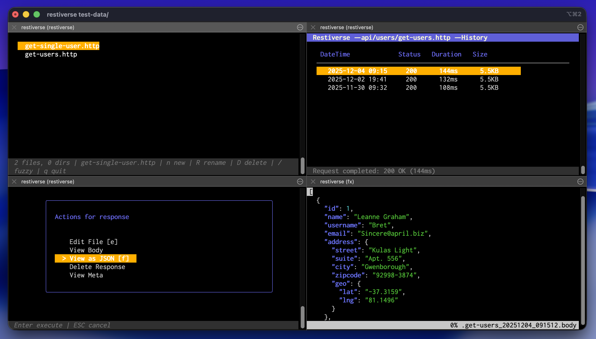

# Restiverse

A terminal-based REST API client written in Go that bridges the gap between powerful command-line tools and the convenience of a unified interface.



## Features

- **Terminal-native**: Built for developers who live in the terminal
- **File-based workflow**: All requests and responses are files that can be versioned, shared, and scripted
- **Variable substitution**: Dynamic URLs and headers for different environments (dev/staging/prod)
- **Midnight Commander-style navigation**: Familiar and efficient directory browsing
- **Configurable actions**: Execute custom commands on response files
- **Large output friendly**: Designed to handle massive JSON responses
- **Zero lock-in**: Uses simple `.http` files and YAML configuration

## Installation

```bash
# Clone the repository
git clone https://github.com/cvidmar/restiverse.git
cd restiverse

# Build the binary
go build -o restiverse ./cmd/restiverse

# Optionally, move to your PATH
sudo mv restiverse /usr/local/bin/
```

## Quick Start

```bash
# Start in current directory
restiverse

# Start in a specific directory
restiverse ~/api-tests

# Enable debug logging
DEBUG=1 restiverse .
```

## Usage

### Creating HTTP Requests

Create `.http` files with the following format:

```http
GET https://api.example.com/users
Accept: application/json
```

POST with JSON body:

```http
POST https://api.example.com/users
Content-Type: application/json

{
  "name": "John Doe",
  "email": "john@example.com"
}
```

### Variable Substitution

Use variables in your requests for dynamic URLs and headers across different environments:

```http
GET https://srv-{node}.{environ}.example.com/api
Authorization: Bearer {token}
```

Define available values in `restiverse.yaml` (example):

```yaml
vars:
  environ:
    - stage
    - prod
  node:
    - a
    - b
    - c
  token:
    - staging-token-xyz
    - prod-token-abc
```

**Using variables:**
- Press **v** on any `.http` file to configure variable values
- Navigate through variables and select values with arrow keys
- Values are saved in `.vars` files and remembered for future requests
- The file browser shows current values: `https://srv-{node:a}.{environ:stage}.example.com/api`
- Variables are automatically substituted when executing requests

### Navigation

- **Arrow Keys (↑/↓)**: Navigate through files and folders
- **Enter**: Open folder or show actions for file
- **Backspace**: Navigate to parent directory
- **Space**: Multi-select files
- **n**: Create new `.http` file (opens in `$EDITOR`)
- **v**: Configure variables (when `.http` file with variables is selected)
- **r**: Execute HTTP request (when `.http` file is selected)
- **h**: View response history
- **e**: Edit file in your `$EDITOR`
- **/**: Open fuzzy finder (use arrow keys to navigate results)
- **ESC**: Close modals/cancel operations
- **q** or **Ctrl+C**: Quit

### Response Storage

When you execute a request, Restiverse creates a `responses/` folder next to your `.http` file and stores:

- `FILENAME_YYYYMMDD_HHMMSS.meta` - Request/response metadata (YAML)
- `FILENAME_YYYYMMDD_HHMMSS.body` - Response body

**Automatic Cleanup:** By default, Restiverse keeps only the 5 most recent response files per `.http` file. When you execute a request and save a new response, older responses beyond the limit are automatically deleted. You can configure this with the `max_responses` setting (set to `0` for unlimited).

### Configuration

Restiverse uses `restiverse.yaml` for configuration. A default config is created automatically when you first run the app in a directory.

Example configuration:

```yaml
# Request settings
timeout: 30s

# Editor (defaults to $EDITOR)
editor: $EDITOR

# Response history management
max_responses: 5  # Keep only the 5 most recent responses per .http file (0 = unlimited)

# Variable definitions for URL/header substitution
vars:
  environ:
    - stage
    - prod
  node:
    - a
    - b
    - c

# Actions
actions:
  - name: "Execute Request"
    command: "internal:execute"
    keybinding: "r"
    min_files: 1
    max_files: 1
    file_types: ["http"]

  - name: "Edit File"
    command: "$EDITOR {filename}"
    keybinding: "e"
    min_files: 1
    max_files: 1
    file_types: ["http", "body", "meta"]

  - name: "View Output History"
    command: "internal:history"
    keybinding: "h"
    min_files: 1
    max_files: 1
    file_types: ["http"]

  - name: "View Body"
    command: "less {filename}"
    min_files: 1
    max_files: 1
    file_types: ["body"]

  - name: "View as JSON"
    command: "fx {filename}"
    min_files: 1
    max_files: 1
    file_types: ["body"]
```

### Custom Actions

You can define custom actions to process response files using external commands. For example, to view JSON with [fx](https://github.com/antonmedv/fx):

```yaml
actions:
  - name: "View as JSON"
    command: "fx {filename}"
    min_files: 1
    max_files: 1
    file_types: ["body"]
```

Or compare two responses with [jd](https://github.com/josephburnett/jd):

```yaml
actions:
  - name: "Diff Responses"
    command: "jd {filename1} {filename2}"
    min_files: 2
    max_files: 2
    file_types: ["body"]
```

## Example Workflow

1. Create a directory for your API tests:
   ```bash
   mkdir ~/api-tests
   cd ~/api-tests
   ```

2. Create an `.http` file:
   ```bash
   mkdir -p api/users
   cat > api/users/get-users.http <<EOF
   GET https://jsonplaceholder.typicode.com/users
   Accept: application/json
   EOF
   ```

3. Start Restiverse:
   ```bash
   restiverse .
   ```

4. Navigate to the file and press `r` to execute the request

5. View the response history with `h`

6. View response with `less` or process with custom tools

## Try it Out

Test files are included in the `test-data/` directory:

```bash
./restiverse test-data
```

Navigate to `api/users/get-users.http` and press `r` to execute!

## Current Implementation Status

✅ **Fully Implemented:**
- 🗂️ **File browser** with nested folder support and MC-style navigation
- 📝 **`.http` file parsing and execution** with all standard HTTP methods
- 💾 **Response storage** with timestamped `.meta` (YAML) and `.body` files
- 📊 **Response history view** with table layout showing status, duration, and size
- ⚙️ **Action system** with configurable actions via `restiverse.yaml`
- 🔍 **Fuzzy finder** with arrow key navigation (press `/`)
- ✅ **Multi-selection** support (Space key)
- ⏱️ **Request execution** with timeout and cancellation (ESC)
- 🌳 **Configuration hierarchy** with child folder override support
- 🛠️ **External tool integration** with proper terminal handoff
- ⌨️ **Action keybindings** (r, e, h, n, v, etc.)
- ✏️ **File creation** - press 'n' to create new `.http` files
- 🔐 **Credential masking** in `.meta` files (Authorization headers)
- 🔄 **Variable substitution** for dynamic URLs and headers across environments (press 'v')

⏳ **Not Yet Implemented (Future Enhancements):**
- OAuth flows and dynamic token generation
- GraphQL/WebSocket/gRPC support
- Pre-request scripts and response assertions
- Collection runner for batch execution

## Development

```bash
# Run tests (when available)
go test ./...

# Build
go build -o restiverse ./cmd/restiverse

# Run with debug logging
DEBUG=1 ./restiverse test-data
```

## Contributing

Contributions are welcome, but hang on a sec, this is still very early stage.

## License

See [LICENSE](LICENSE) for details.

## Acknowledgments

Built with:
- [Bubbletea](https://github.com/charmbracelet/bubbletea) - TUI framework
- [Lipgloss](https://github.com/charmbracelet/lipgloss) - Style library
- [Bubbles](https://github.com/charmbracelet/bubbles) - TUI components

Inspired by tools like Postman, Insomnia, and HTTPie, but designed for terminal lovers who want the power of command-line tools.
